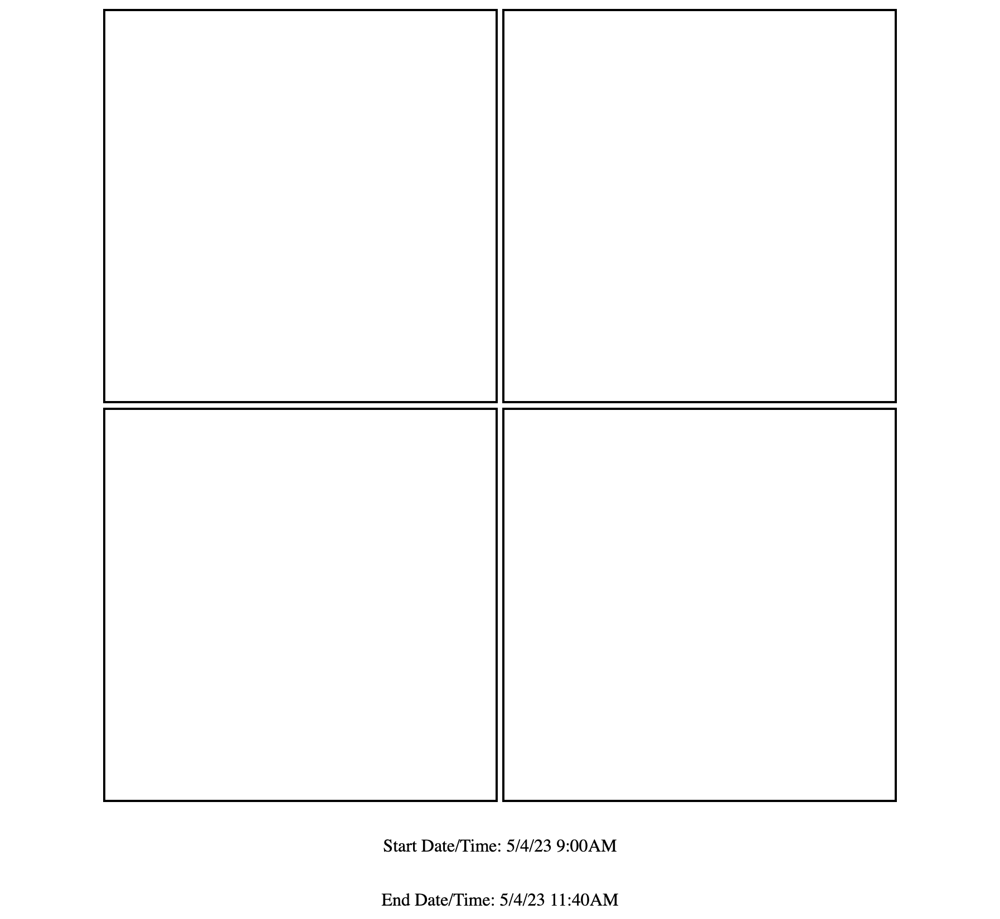

<!-- PROJECT SHIELDS -->
<!--
*** I'm using markdown "reference style" links for readability.
*** Reference links are enclosed in brackets [ ] instead of parentheses ( ).
*** See the bottom of this document for the declaration of the reference variables
*** for contributors-url, forks-url, etc. This is an optional, concise syntax you may use.
*** https://www.markdownguide.org/basic-syntax/#reference-style-links
-->

<!-- 
 -->

[![alex-linkedin-shield]][alex-linkedin-url]
[![steve-linkedin-shield]][steve-linkedin-url]

<!-- 
 -->

<!-- PROJECT LOGO -->
 

  

<h3 align="center">Project 1</h3>

  

    Bienvenue! 
     
    <a href="https://github.com/grammerjam/tm-main/issues/new">Report Bug</a>
  

<!-- TABLE OF CONTENTS -->

  
Table of Contents

  <ol>
    <li>
      <a href="#about-the-project">About MangoJS</a>
      <ul>
        <li><a href="#built-with">Built With</a></li>
      </ul>
    </li>
    <li>
      <a href="#getting-started">Getting Started</a>
    </li>
    <li><a href="#contact">Contact</a></li>
    <li><a href="#acknowledgments">Acknowledgments</a></li>
  </ol>

<!-- ABOUT THE PROJECT -->

## About MangoJS

This project features a responsive shape built with HTML and CSS.

### Built With

![HTML][Html]![CSS][Css]

(<a href="#readme-top">back to top</a>)

<!-- GETTING STARTED -->

## Getting Started

From the tm-main folder, go to the project1 folder, [open the index.html in a browser](https://www.indeed.com/career-advice/career-development/how-to-open-html-file), or [from VSCode](https://www.wikihow.com/Run-a-HTML-File-in-Visual-Studio-Code#:~:text=Type%20start%20followed%20by%20the,to%20preview%20your%20HTML%20file.) or another IDE.

(<a href="#readme-top">back to top</a>)

<!-- CONTACT -->

## Contact

Steve Smodish - [GitHub](https://github.com/ssmodish)
 
Alex Curtis-Slep - [GitHub](https://github.com/AlexVCS) / [Twitter](https://twitter.com/alexcurtisslep) / alexcurtisslep@gmail.com

<!-- ACKNOWLEDGMENTS -->

## Acknowledgments

- Muchos gracias to Allan Tito for the feedback, encouragement, and PM'ing
- Thanks to the senior devs from Grammerhub for reviewing our projects

(<a href="#readme-top">back to top</a>)

<!-- MARKDOWN LINKS & IMAGES -->
<!-- https://www.markdownguide.org/basic-syntax/#reference-style-links -->

[contributors-shield]: https://img.shields.io/github/contributors/github_username/repo_name.svg?style=for-the-badge
[contributors-url]: https://github.com/github_username/repo_name/graphs/contributors
[forks-shield]: https://img.shields.io/github/forks/github_username/repo_name.svg?style=for-the-badge
[forks-url]: https://github.com/github_username/repo_name/network/members
[stars-shield]: https://img.shields.io/github/stars/github_username/repo_name.svg?style=for-the-badge
[stars-url]: https://github.com/github_username/repo_name/stargazers
[issues-shield]: https://img.shields.io/github/issues/github_username/repo_name.svg?style=for-the-badge
[issues-url]: https://github.com/github_username/repo_name/issues
[license-shield]: https://img.shields.io/github/license/github_username/repo_name.svg?style=for-the-badge
[license-url]: https://github.com/github_username/repo_name/blob/master/LICENSE.txt
[alex-linkedin-shield]: https://img.shields.io/badge/-Alex's_LinkedIn-black.svg?style=for-the-badge&logo=linkedin&colorB=555
[alex-linkedin-url]: https://www.linkedin.com/in/alexcurtisslep/
[steve-linkedin-url]: https://www.linkedin.com/in/stevesmodish/
[steve-linkedin-shield]: https://img.shields.io/badge/-Steve's_LinkedIn-black.svg?style=for-the-badge&logo=linkedin&colorB=555
[Html]: https://img.shields.io/badge/HTML-239120?style=for-the-badge&logo=html5&logoColor=white
[Css]: https://img.shields.io/badge/CSS-239120?&style=for-the-badge&logo=css3&logoColor=white
