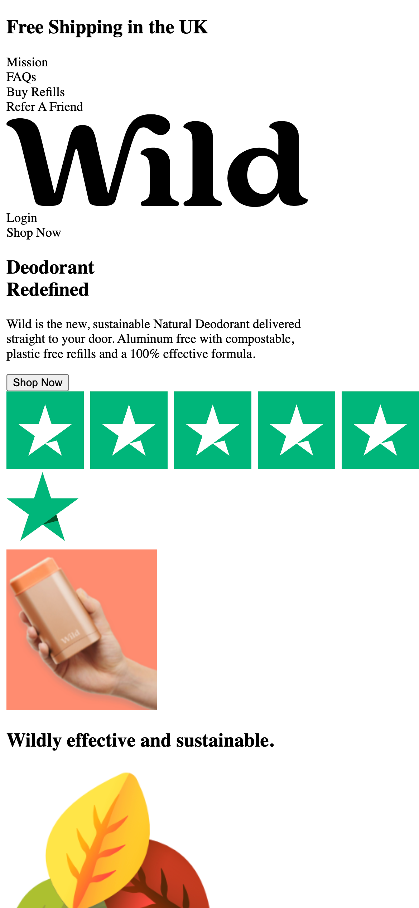

[![alex-linkedin-shield]][alex-linkedin-url]
[![steve-linkedin-shield]][steve-linkedin-url]

  <h3 align="center">Project 2</h3>

   

    Bienvenue! 
     
    <a href="https://github.com/grammerjam/tm-main/issues/new">Report Bug</a>
  

## About Project 2

We recreated a page from the Wild Deodorant brand. To run this project you'll need to compile the scss into a `/css` directory.

### Built With

![HTML][Html]![CSS][Css][![SASS][Sass]][Sass-url]

## Instructions for VS Code users

Use these plugins: 
[Live Sass Compiler](https://marketplace.visualstudio.com/items?itemName=ritwickdey.live-sass) 
[Live Server](https://marketplace.visualstudio.com/items?itemName=ritwickdey.LiveServer)  
Once the plugins are installed, hit the "Watch Sass" button on the bottom status bar followed by the "Go Live" button.

From there go to [localhost:5500](http://localhost:5500) or the location given by Live Server.

To install VS Code [click here](https://code.visualstudio.com/download).

## Contact

Steve Smodish - [GitHub](https://github.com/ssmodish)
 
Alex Curtis-Slep - [GitHub](https://github.com/AlexVCS) / [Twitter](https://twitter.com/alexcurtisslep) / alexcurtisslep@gmail.com

[alex-linkedin-shield]: https://img.shields.io/badge/-Alex's_LinkedIn-black.svg?style=for-the-badge&logo=linkedin&colorB=555
[alex-linkedin-url]: https://www.linkedin.com/in/alexcurtisslep/
[steve-linkedin-url]: https://www.linkedin.com/in/stevesmodish/
[steve-linkedin-shield]: https://img.shields.io/badge/-Steve's_LinkedIn-black.svg?style=for-the-badge&logo=linkedin&colorB=555
[Html]: https://img.shields.io/badge/HTML-239120?style=for-the-badge&logo=html5&logoColor=white
[Css]: https://img.shields.io/badge/CSS-239120?&style=for-the-badge&logo=css3&logoColor=white
[Sass-url]: https://sass-lang.com/
[Sass]: https://img.shields.io/badge/Sass-CC6699?style=for-the-badge&logo=sass&logoColor=white
