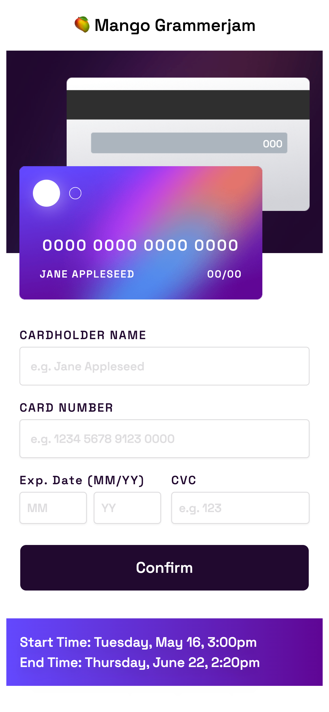

[![alex-linkedin-shield]][alex-linkedin-url]
[![steve-linkedin-shield]][steve-linkedin-url]

  <h3 align="center">Project 3AB</h3>

   

    Bienvenue! 
     
    <a href="https://mango-grammerjam-project3.netlify.app/">View Project 3AB</a>
    ·
    <a href="https://github.com/grammerjam/tm-main/issues/new">Report Bug</a>
  

## About Project 3AB

Enter in test card information-the form validates it and displays errors if needed.

### Built With

[![React][React.js]][React-url][![Tailwind][Tailwindcss]][Tailwind-url][![Vite]][Vite-url]

## Contact

Steve Smodish - [GitHub](https://github.com/ssmodish)
 
Alex Curtis-Slep - [GitHub](https://github.com/AlexVCS) / [Twitter](https://twitter.com/alexcurtisslep) / alexcurtisslep@gmail.com

[alex-linkedin-shield]: https://img.shields.io/badge/-Alex's_LinkedIn-black.svg?style=for-the-badge&logo=linkedin&colorB=555
[alex-linkedin-url]: https://www.linkedin.com/in/alexcurtisslep/
[steve-linkedin-url]: https://www.linkedin.com/in/stevesmodish/
[steve-linkedin-shield]: https://img.shields.io/badge/-Steve's_LinkedIn-black.svg?style=for-the-badge&logo=linkedin&colorB=555
[React.js]: https://img.shields.io/badge/React-20232A?style=for-the-badge&logo=react&logoColor=61DAFB
[React-url]: https://reactjs.org/
[Tailwindcss]: https://img.shields.io/badge/Tailwind_CSS-38B2AC?style=for-the-badge&logo=tailwind-css&logoColor=white
[Tailwind-url]: https://tailwindcss.com/
[Vite-url]: https://vitejs.dev/
[Vite]: https://img.shields.io/badge/Vite-B73BFE?style=for-the-badge&logo=vite&logoColor=FFD62E
